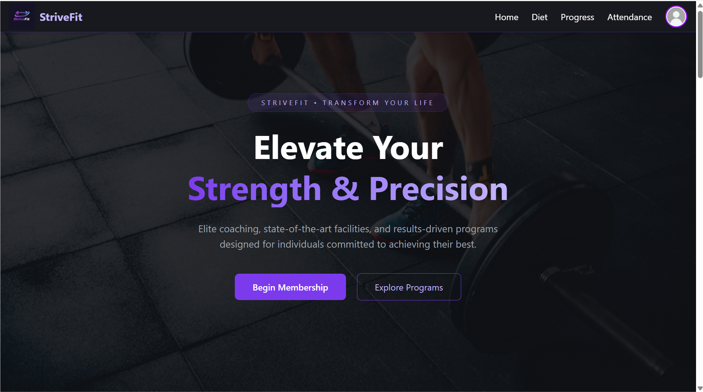
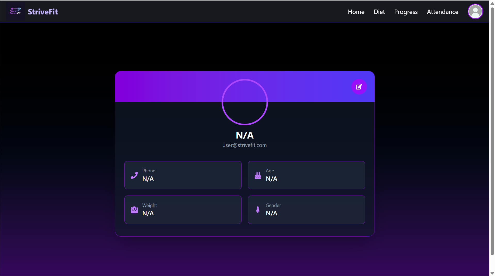
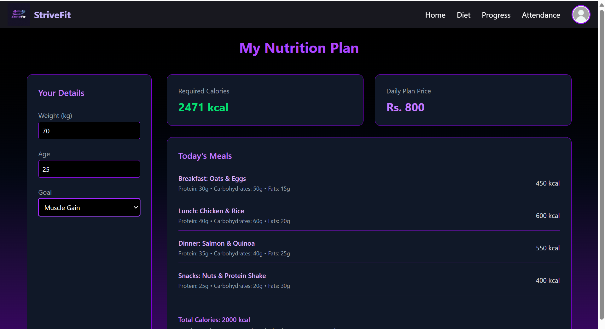
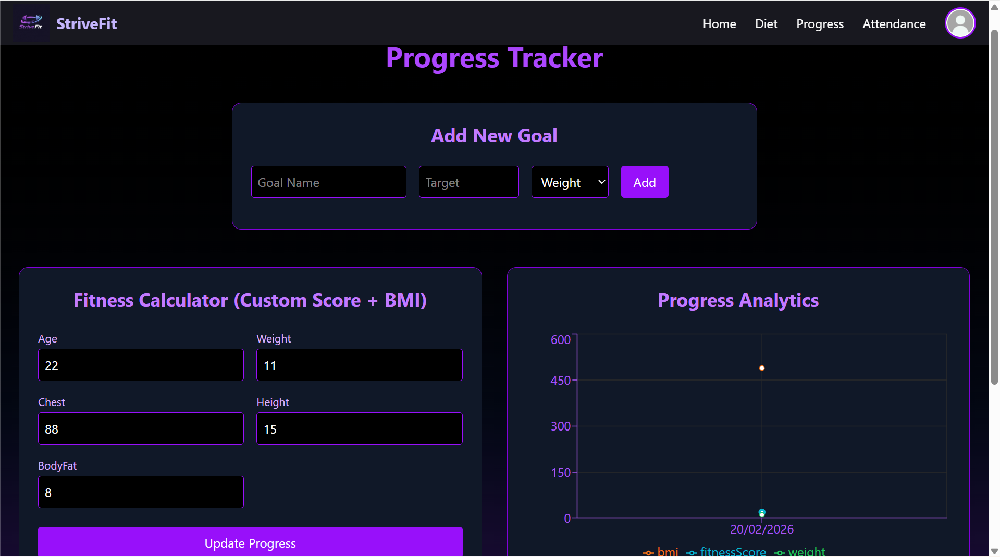
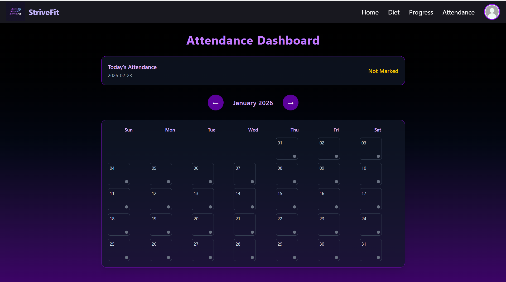
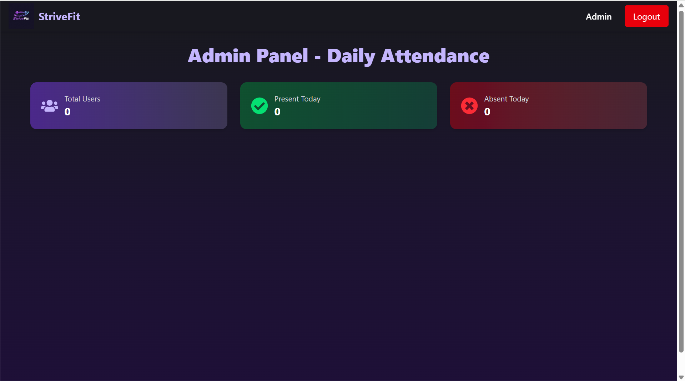

# 💪 STRIVEFIT — Full-Stack Fitness Tracking Platform

STRIVEFIT is a **responsive, full-stack fitness management platform** featuring **dedicated dashboards for Users and Admins**, designed to deliver a **seamless, interactive, and motivating experience**.  

It simulates a real-world fitness ecosystem with **secure authentication, role-based access, personalized workout plans, diet management, attendance tracking, real-time progress visualization**, and **instant notifications for goals and reminders**—all built using **modern web technologies** for a **responsive, engaging, and production-ready application**.  

The platform features **two dynamic dashboards** that work together flawlessly: 

 👤 **User Dashboard** – Personalized fitness tracking, diet management, progress visualization, and instant in-app notifications  
 🛠️ **Admin Dashboard** – Efficiently  **manage attendance** and **monitor the total number of users** with clear records and organized tracking. 

---
## 📂 Project Structure

```text
strivefit/
├── Screenshots/        # Project UI screenshots
├── public/             # Static assets
├── src/                # Main application source code
│   ├── assets/         # Images, icons, and other static assets
│   ├── components/     # Reusable UI components
│   ├── pages/          # Application pages (User/Admin)
│   ├── context/        # Global state management (Context API)
│   ├── config/         # Configuration files (Firebase, etc.)
│   ├── App.jsx         # Root component
│   ├── App.css         # Styles for App.jsx
│   ├── main.jsx        # Entry point for React app
│   └── index.css       # Global CSS styles
│
├── index.html          # Entry HTML file
├── package.json        # Project dependencies & scripts
├── package-lock.json   # Dependency lock file
├── vite.config.js      # Vite configuration
├── eslint.config.js    # ESLint configuration
├── .gitignore
├── .gitattributes
└── README.md
```

## ✨ Key Highlights

 🔐 **Role-Based Authentication** (User / Admin)  
 ⚡ **Real-Time Data Synchronization** (Firestore)  
 📊 **Interactive Progress Tracking** (BMI, Weight, Fitness Score)  
 🔔 **Real-Time Toast Notifications** (Sonner)  
 ☁️ **Secure Cloud Media Storage** (Cloudinary)  
 🧠 **Global State Management** (React Hooks + Context API)  
 📱 **Fully Responsive & Animated UI**  
 📈 **Admin Dashboard with Monitoring & Controls**  


## 👤 User Dashboard Features

 📝 Secure Signup / Login using Firebase Authentication  
 🏋️ Personalized Fitness Plans & Diet Charts  
 💪 Workout Goal Management (Full CRUD Operations)  
 📅 Attendance Tracking  
 👤 Profile Management  
 📈 Recharts-Based Progress Visualization  
 🔔 Real-Time Success/Error Notifications using Sonner  
 💾 Firestore Real-Time Listeners  


## 🛠️ Admin Dashboard Features

 🛡️ Role-Based Access Control  
 👥 User Management & Monitoring  
 📊 Attendance Overview   
 📨 Newsletter Subscription Management  
 ☁️ Secure Cloud-Synchronized Data Control  


## 🧩 Tech Stack

**Frontend:**  
⚛️ React (Hooks, Context API), ⚡ Vite, 🎨 Tailwind CSS, 🌐 React Router DOM, 🔔 Sonner  

**Backend / Database:**  
🔐 Firebase Authentication, 💾 Firestore 

**Cloud Services:**  
☁️ Cloudinary (Media Storage)  

**Data Visualization:**  
📊 Recharts  

**Version Control:**  
🗂️ Git & GitHub  


## 📈 Engineering Highlights

- 🔐 Implemented secure **role-based authentication architecture**   
- 📊 Built **real-time analytics dashboards**  
- 🔔 Integrated **Sonner** for non-blocking UI notifications  
- 🧠 Applied **global state management** using Context API  
- 🧩 Developed **modular, reusable component architecture**  


## 📦 Installation

Clone the repository:
```bash
https://github.com/adiba-anwar01/StriveFit.git
```
Install Dependencies

    npm install

Configure Environment Variables

Create a .env file (if using Firebase, Cloudinary, etc.) and add your keys.

Start the Development Server

    npm run dev

   Build & run! 🚀


## 🌱 Current Scope

✅ Personalized fitness plans and diet charts  
✅ Workout goal management (Add / Update / Delete)  
✅ Attendance tracking with admin controls  
✅ Role-based dashboards (User & Admin)  
✅ Real-time progress visualization  
✅ Mobile-responsive design with smooth animations  


## 🔮 Future Enhancements

💪 AI-powered fitness suggestions & predictive analytics   
📲 Mobile PWA with push notifications for goals & reminders  
🔗 Integration with wearable devices (Fitbit, Apple Health)  
📅 Schedule-based workout reminders and diet alerts 
💳 Online payments for fitness plans & subscriptions  
📊 Advanced admin analytics & reporting dashboard  


## 🎨 Customization Guidelines

🎨 Modify Tailwind CSS configuration in `tailwind.config.js` for custom themes  
🧩 Add new components in `src/components` or pages in `src/pages`  
🔐 Extend roles & permissions in Firebase Authentication  
💾 Modify Firestore collections for additional features  
🔄 Global state management can be customized in `src/context/`  
📸 Replace assets (images/icons) in `src/assets/`  

## 📸 Screenshots

### 💻 Desktop & Dashboard Views

| 🏠 **User Home** |
|:--:|
| [](Screenshots/user_home.png) |

| 👤 **User Profile** |
|:--:|
| [](Screenshots/user_profile.png) |

| 🥗 **User Diet Chart** |
|:--:|
| [](Screenshots/user_diet.png) |

| 📊 **Progress Tracker** |
|:--:|
| [](Screenshots/user_progress.png) |


| 📅 **Attendance Tracker** |
|:--:|
| [](Screenshots/user_attendance.png) |

| 🛠️ **Admin Dashboard** |
|:--:|
| [](Screenshots/admin.png) |

⚡ Empowering your fitness journey, one milestone at a time.

---

## ❤️ Why StriveFit?

- 🔥 **Complete Fitness Management** – Track workouts, diet, attendance, and progress all in one platform.  
- ⚡ **Real-Time Analytics & Notifications** – Live updates via **Firebase Firestore** and **Sonner notifications**.  
- 🎨 **Clean & Responsive UI** – Smooth transitions with mobile-first design for all devices.  
- 🛠️ **Modular & Scalable** – Easily extendable React components and dashboards.  
- 💡 **Future-Ready** – Ready to integrate AI suggestions, wearable device syncing, and social features.  

> 💪 StriveFit empowers users to **achieve fitness goals efficiently**, while giving admins **full control** over management and tracking.

---

## 🤝 Contributing

Have ideas to **enhance StriveFit**?  
Feel free to fork this repository, open issues, or submit pull requests.  
Thoughtful contributions, improvements, and feedback are always welcome. 


📬 **Contact Me:**  
📧 Email: **adibadeveloper02@gmail.com**  

> Crafted with passion by **Adiba**, focusing on building **scalable, interactive, and user-friendly web applications**.  

⚡ **StriveFit** — **track your fitness today, achieve your goals tomorrow, and grow stronger every step of the way!**
